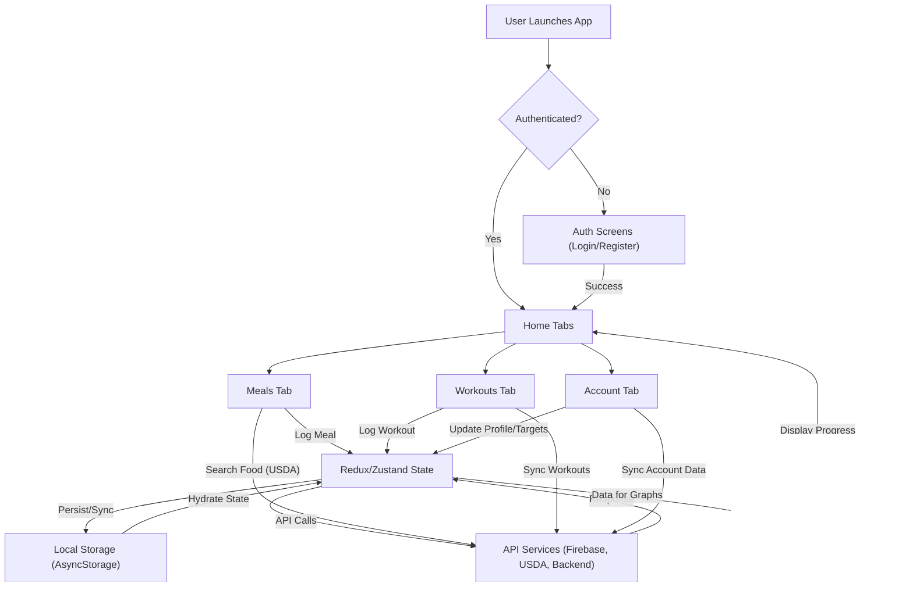

# State of Health Tracking App – Flow & Architecture

## 1. Overview of the App's Functionality

The State of Health Tracking App is a comprehensive mobile application designed to help users track both their fitness and nutrition goals in a unified, user-friendly interface. The app enables users to:

- Log workouts and track progressive overload (increasing reps/weight over time)
- Record daily meals and monitor macronutrient intake
- Search for food items using the USDA food database
- Visualize progress with graphs and charts for both workouts and nutrition
- Maintain a daily diary of logged workouts and meals
- Set and track personal targets for calories and workouts
- Manage their account, including authentication and data sync

The app is built with simplicity and usability in mind, removing unnecessary features and focusing on core health tracking needs. It is implemented using Expo (React Native), integrates with Firebase for authentication and backend services, and leverages the USDA API for food data. The app supports both iOS simulators and physical devices, and is structured for easy development and deployment via Expo EAS.

---

## 2. Key Components and Technologies Used

### Technologies

- **React Native & Expo**: The app is built using React Native, managed with Expo for streamlined development and deployment.
- **Firebase**: Used for authentication, crash reporting, and backend services (via @react-native-firebase/app, auth, crashlytics, firestore).
- **Redux & Zustand**: State management is handled with Redux (with redux-persist for persistence) and Zustand for some stores.
- **USDA Food API**: Integration for food search and nutrition data.
- **Navigation**: React Navigation (bottom tabs, native stack) for screen and tab navigation.
- **AsyncStorage**: For local data persistence.
- **Jest**: For testing.
- **Other Libraries**: Includes axios (HTTP requests), lodash (utility), immer (immutability), date-fns (date utilities), and more.

### Key Components & Structure

- **App Entry**: `App.tsx` initializes providers, navigation, and global UI elements.
- **Navigation**: `src/navigation/` contains stack/tab navigators for authentication, meals, workouts, and account screens.
- **Screens**: `src/screens/` holds all main UI screens (e.g., Meals, Workouts, Account, Auth, Register, etc.).
- **Components**: `src/components/` provides reusable UI elements (buttons, forms, graphs, dialogs, etc.).
- **State Management**: `src/store/` contains Redux reducers, actions, and Zustand stores for user, meals, workouts, etc.
- **Services**: `src/service/` handles API calls, authentication, and data sync logic.
- **Data Models**: `src/data/models/` defines TypeScript models for core entities (User, Meal, Exercise, WorkoutDay, etc.).
- **Constants**: `src/constants/` for static values (API endpoints, screen names, strings, etc.).
- **Styles**: `src/styles/` for theming and shared styles.

---

## 3. Detailed Flow of Data and User Interactions

### Authentication Flow

- **User Action:** User opens the app and is prompted to log in or register.
- **UI:** Auth screens (`src/screens/Auth`, `src/screens/Login`, `src/screens/Register`) collect credentials.
- **State Management:** `useAuthStore` (Zustand) manages authentication state. Redux is also used for some legacy flows.
- **Service:** `AuthService` (Firebase) handles registration, login, logout, and user deletion. On success, user data is fetched and stored locally.
- **Persistence:** User session is persisted using AsyncStorage and redux-persist.
- **Example:**
  1. User enters email/password and taps "Log In".
  2. Credentials sent to Firebase via `AuthService`.
  3. On success, user state is updated and app navigates to the main Home screen.

### Workout Tracking Flow

- **User Action:** User navigates to the Workouts tab to log or view workouts.
- **UI:** Workouts screens (`src/screens/Workouts`) display daily exercises, sets, and allow adding/removing exercises/sets.
- **State Management:** `useDailyWorkoutEntryStore` (Zustand) manages the current workout day, exercises, and sets.
- **Service:** Workout data is synced with backend via `syncWorkoutDay` and `syncOfflineWorkouts` (handles offline/online sync).
- **Persistence:** Workouts are stored locally and synced to the backend when online.
- **Example:**
  1. User adds a new exercise to today’s workout.
  2. State is updated in `useDailyWorkoutEntryStore` and persisted locally.
  3. When online, workout is synced to backend API.

### Meal Tracking Flow

- **User Action:** User navigates to the Meals tab to log meals and foods.
- **UI:** Meals screens (`src/screens/Meals/MealsScreen`) display meals for the day and allow adding foods.
- **State Management:** Redux manages meals, foods, and daily meal entries.
- **Service:** Food data can be searched via the USDA API. Meals and foods are persisted locally and synced to backend.
- **Persistence:** Meals and foods are stored in Redux state and persisted with redux-persist.
- **Example:**
  1. User adds a food item to lunch.
  2. Redux state is updated and persisted.
  3. Data is synced to backend on app state change or when user is online.

### Data Visualization Flow

- **User Action:** User views progress graphs for workouts and nutrition.
- **UI:** Graph components (e.g., `BarGraph`, `WeeklyWorkoutsGraphModule`) render charts based on state data.
- **State Management:** Data is selected from Redux/Zustand stores.
- **Example:**
  1. User opens the Workouts tab.
  2. Weekly workout summaries are fetched and displayed in a graph.

### Data Sync and Offline Support

- **Sync:** On app state change (e.g., app becomes active), user data is synced with backend if authenticated.
- **Offline:** Workouts and meals can be logged offline and are synced when connectivity is restored.

---

## 4. Major Dependencies and Libraries Utilized

Below are the key dependencies and libraries used in the State of Health Tracking App, along with their primary roles:

- **expo**: Framework for React Native apps, simplifies development and deployment.
- **react-native**: Core library for building native mobile apps using React.
- **@react-navigation/native, @react-navigation/bottom-tabs, @react-navigation/native-stack**: Navigation and routing between screens and tabs.
- **redux, react-redux, redux-persist, redux-thunk**: State management, async actions, and persistence.
- **zustand**: Lightweight state management for some stores.
- **@react-native-firebase/app, auth, crashlytics, firestore**: Firebase integration for authentication, crash reporting, and backend data.
- **@expo/vector-icons, react-native-svg**: Icon and SVG support for UI.
- **@gorhom/bottom-sheet**: Bottom sheet UI component.
- **@react-native-async-storage/async-storage**: Local data persistence.
- **axios**: HTTP client for API requests.
- **date-fns**: Date utility functions.
- **immer**: Immutable state updates.
- **lodash**: Utility functions.
- **jest**: Testing framework.
- **react-native-toast-message**: Toast notifications.
- **fp-ts, io-ts**: Functional programming and runtime type checking.
- **expo-file-system, expo-font, expo-haptics, expo-splash-screen, expo-status-bar**: Various Expo modules for file access, fonts, haptics, splash screen, and status bar control.
- **uuid**: Unique ID generation.
- **rxjs**: Reactive programming utilities.

This list is not exhaustive but covers the most important libraries that power the app’s core features and user experience.

---

## 5. App Flow Diagram

Below is a Mermaid diagram illustrating the main flow of the app, from user actions through navigation, state management, API calls, and data rendering:

---

## 6. Examples of Data Flows and User Interactions

### Example 1: Logging a Meal

1. **User Action:** User taps the Meals tab and selects "Add Food" for Lunch.
2. **UI:** The Add Food screen appears, allowing the user to search for a food item (using the USDA API) or create a custom food.
3. **State Update:** Upon selection, the food is added to the Redux state for the Lunch meal.
4. **Persistence:** The updated meal is persisted locally (redux-persist) and will be synced to the backend when online.
5. **Visualization:** The meal’s calories/macros are reflected in daily progress charts.

### Example 2: Logging a Workout

1. **User Action:** User taps the Workouts tab and adds a new exercise to today’s workout.
2. **UI:** The exercise is added to the list, and the user can log sets/reps/weight.
3. **State Update:** The workout is updated in the Zustand store (`useDailyWorkoutEntryStore`).
4. **Persistence:** The workout is saved locally and synced to the backend when online.
5. **Visualization:** The workout appears in weekly progress graphs.

### Example 3: Authentication and Data Sync

1. **User Action:** User opens the app and logs in.
2. **UI:** Auth screens collect credentials and show loading state.
3. **State Update:** On success, user state is updated and user-specific data is fetched from backend.
4. **Persistence:** User session and data are persisted locally.
5. **Sync:** On app resume or when online, user data is synced with backend.

### Example 4: Offline Support

1. **User Action:** User logs a workout or meal while offline.
2. **State Update:** Data is stored locally (Zustand/Redux + AsyncStorage).
3. **Sync:** When connectivity is restored, data is automatically synced to backend.

---

## Review & Summary

This document provides a comprehensive overview of the State of Health Tracking App, including:

- A high-level summary of the app’s purpose and features
- Key components, technologies, and codebase structure
- Detailed explanations of data flow and user interactions, with concrete examples
- A list of major dependencies and their roles
- A visual Mermaid diagram illustrating the main app flow
- Step-by-step examples of typical user actions and how data moves through the system

This should serve as a clear reference for onboarding, development, and understanding the architecture and flow of the app.
